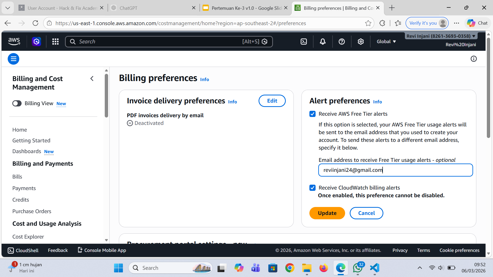
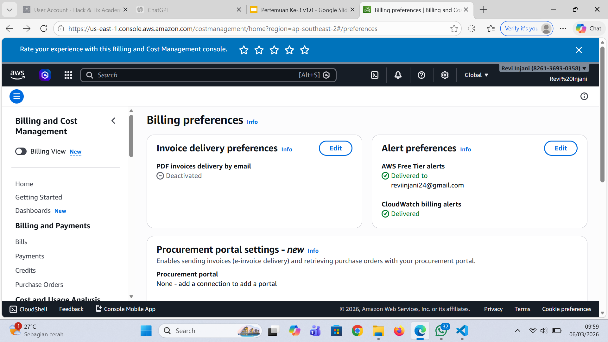
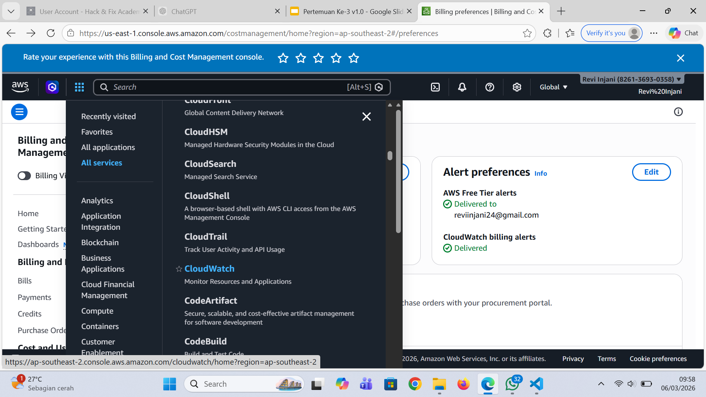
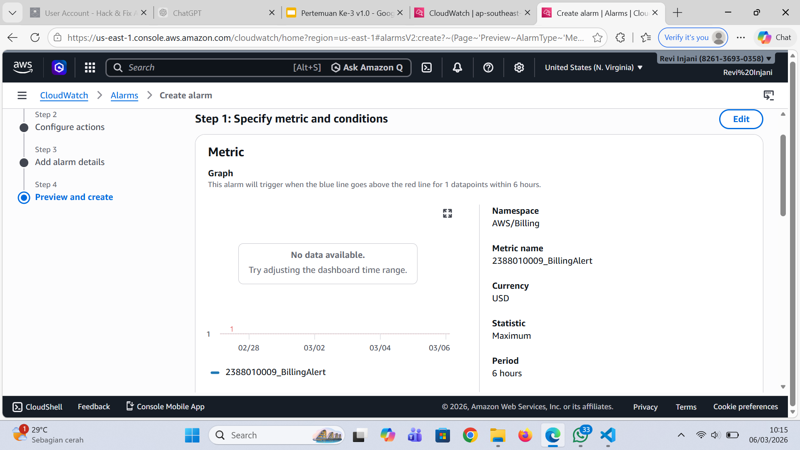
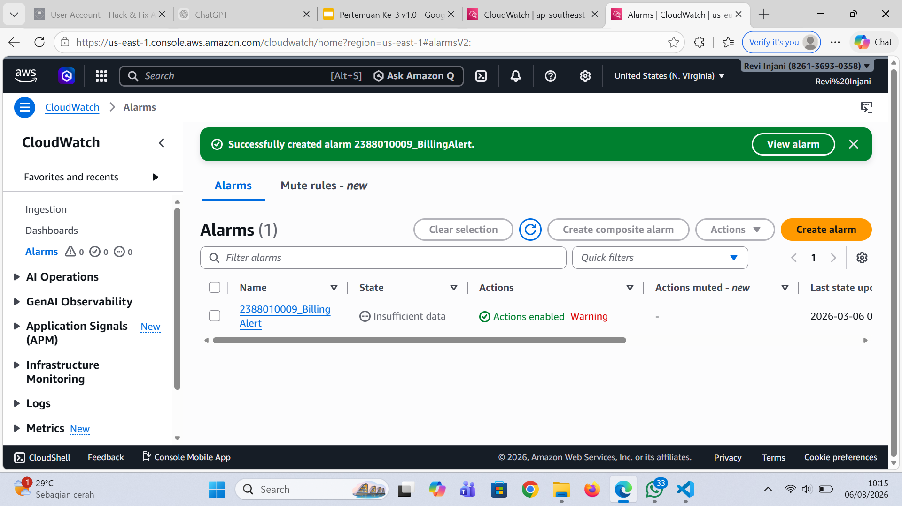

# Membuat Billing Alert di AWS untuk menghindari kelebihan alokasi Dana

1. Menu Dashboard AWS kita pilih Billing Preferences untuk mengaktifkan Alert
 - Masuk Menu Billing and Cost Manajemen
 - Pada Menu Cost Manajemen Scroll ke bawah pilih Billing Preferences
 - Pilih Menu Alert Preferences klik Edit
 - Isi Email ceklis Receive
 - Klik Update
 
 

 2. Masuk Menu Cloudwatch, All Service Pilih Cloudwatch
 

 3. Pilih Menu Create Alarm
 - Pastikan Region ada di US N Virginia
 - Klik Menu Create Alert
 - Klik Metric
 - Klik Menu Billing
 - Pilih Menu Total Estimated Charge
 - Pilih / Ceklis Mata Uang USD
 - Klik Select Metric
 - Beri nama Alert = 2388010009_BillingAlert
 - Conditions Static -> Greathertha -> 1 USD
 - Create new Topic => 2388010009_BillingAlert => Klik Create
 - Select an existing SNS topic -> 2388010009_BillingAlert
 - Klik Next
 - Alarm Name -> 2388010009_BillingAlert
 - Create Alarm
 - Buka Inbox/Spam dari AWS kemudian klik confirm 

 
 