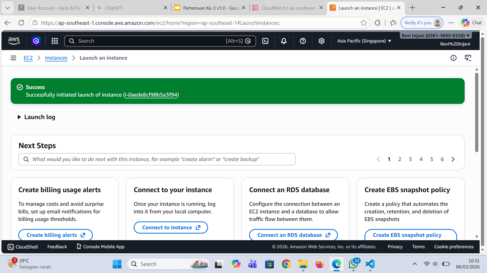
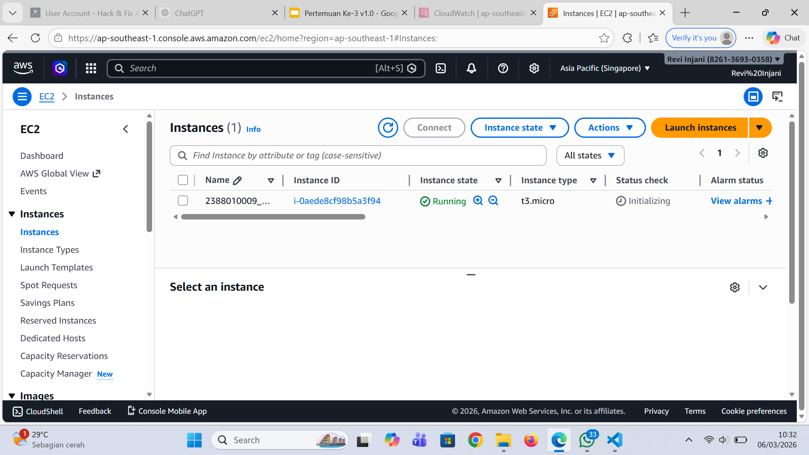

# Membuat VM / Instance di AWS EC2 DGN AMI

1. Buka Menu EC2 dari Dashboard
2. Klik Menu Launch Instance
3. Pastikan memilih Region Terdekat
4. Isi Nama Instace -> dengan 2388020009_Server6A
5. OS pilih Linux Ubuntu
6. Instance Type pilih T3.Micro
7. Membuat Key Pair -> Create new key pair -> Isi nama -> file .pem -> Create
8. Network Security
- Allow SSH Traffic
- Allow HTTPS
- Allow HTTP
9. Storage Setting-> 30Gb
10. Klik Launch Instance
11. Pastikan Alert Sukses
12. Pastikan nama sesuai -> klik Instance

 
