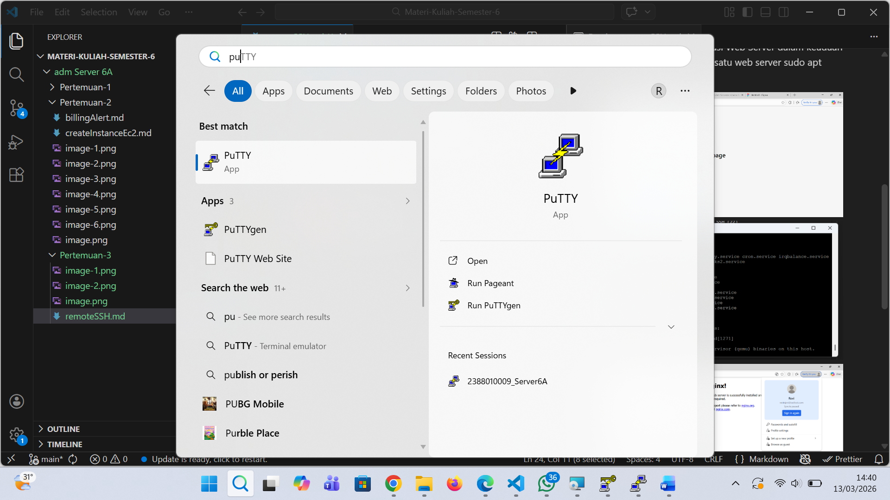
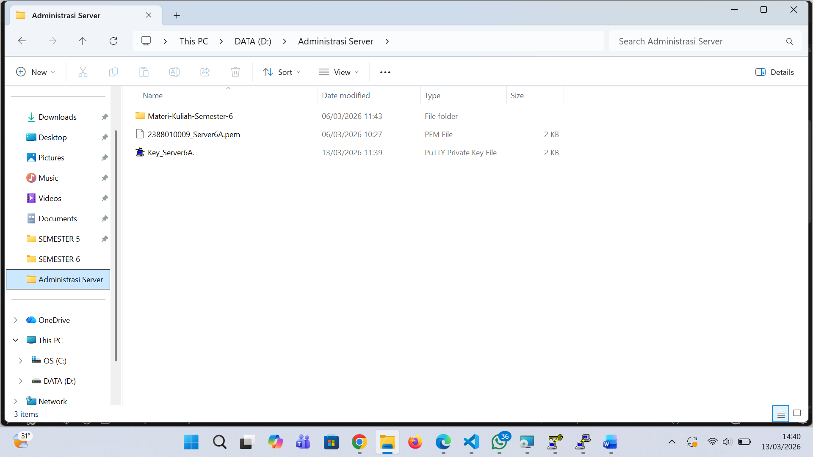
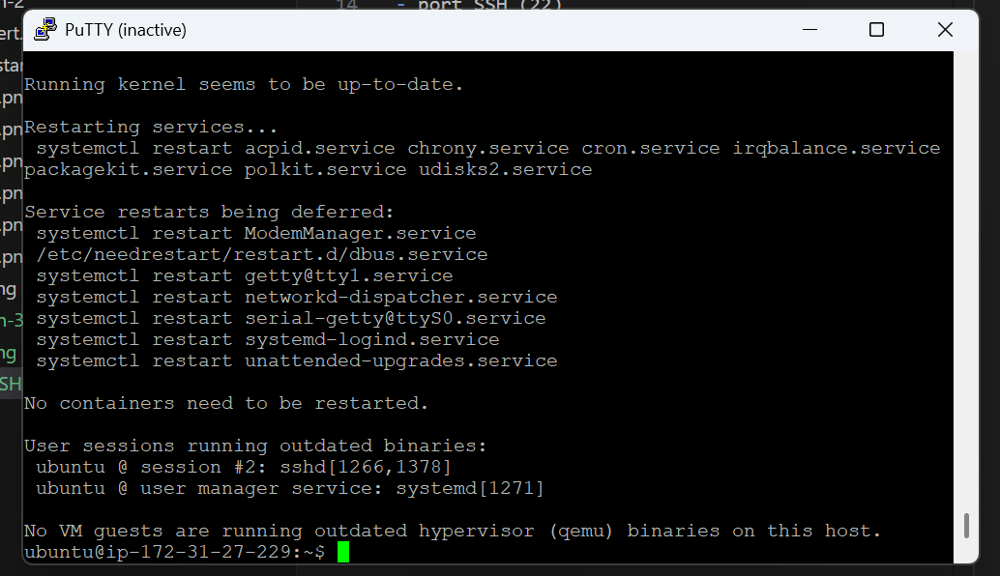
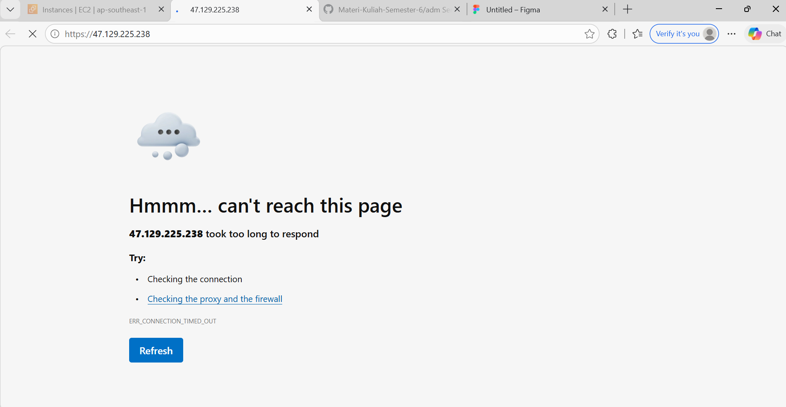
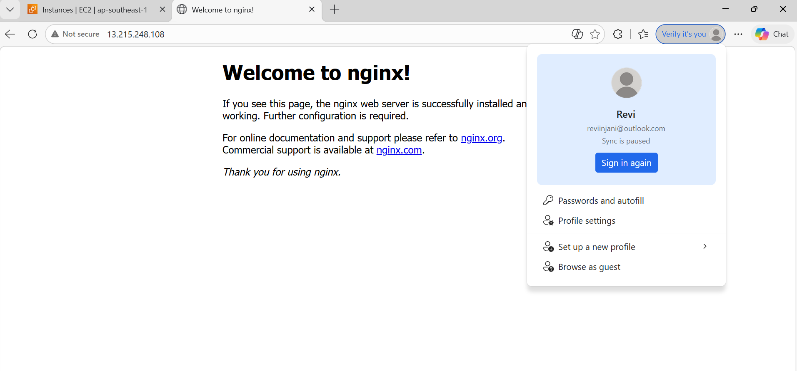

# Remote SSH dari AWS EC2 Server

1. Unduh dan Instal Putty di https://www.chiark.greenend.org.uk/~sgtatham/putty/latest.html

2. Konversi ekstensi Private Key dari .pem menjadi .ppk
- Buka Putty Gen
- Load Private Key .pem
- Klik Save Private key menjadi ekstensi File .ppk

3. Setting-Up Remote SSH dengan Putty 
- Isi Ipv4 addres Public data berasal dari instance masing2
- port SSH (22)
- load private key .ppk di menu Connection-> SSH -> Auth -> Credential
- user dari instance masing-maing ubuntu

4. Setiap awal Remote kita lakukan Patching OS 
- sudo apt-get update && sudo apt-get upgrade

5. coba lakukan instalasi Web Server dalam keadaan kosong
Instal salah satu web server sudo apt instal nginx

