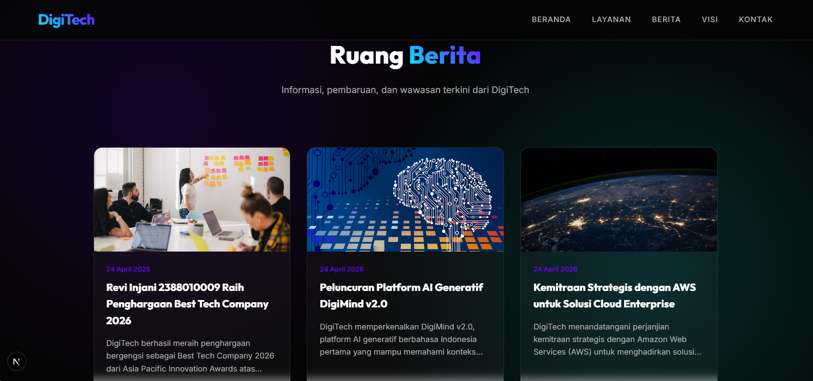

# Deploy Web Apps Framework Next.js ke AWS

1. Pastikan Web Apps berjalan di Local
- install dependensi -> npm install
- create db dan import sql
- create file .env dan isi sesuaikan dengan db local
- jalankan web apps -> npm run dev
- akses web apps di browser http://localhost:3000
- testing front pastikan tampilan muncul dan tanpa error
- testing backend http://localhost:3000/admin
    username: admin
    pass    : admin123

- create static file -> npm run build
- archive folder standalone -> zip -> klik kanan folder standalone -> send to -> compressed (zipped) folder
